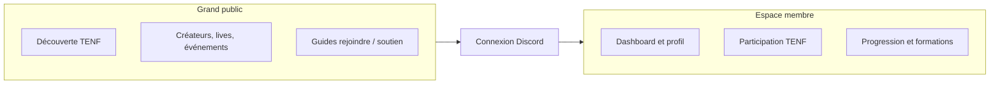
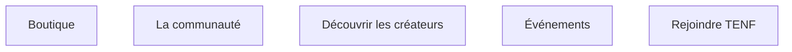

# TENF V2 — Export pour assistant (vue utilisateur)

**Usage recommandé :** joindre ce fichier à une conversation ChatGPT (ou copier-coller son contenu) pour fournir le contexte **grand public + espace membre**, sans détail technique d’implémentation.

**Périmètre :** navigation et parcours utilisateur. L’administration (`/admin`) n’est décrite que comme zone réservée au staff.

**Stack (rappel minimal) :** site Next.js, connexion membre via **Discord** (NextAuth), page de connexion typique `/auth/login`, redirection fréquente vers `/member/dashboard` après login.

---

## 1. Résumé en une phrase

TENF New Family propose une **partie publique** pour découvrir la communauté, les créateurs et les événements, et un **espace membre connecté** pour le profil personnel, le planning, les raids, les objectifs, l’Academy, les formations et les notifications.

---

## 2. Accès par zone

| Zone | Préfixe / exemples | Qui y accède |
|------|-------------------|--------------|
| Public | `/`, `/boutique`, `/membres`, `/events2`, `/rejoindre/…`, etc. | Tout le monde (sans obligation de connexion pour la lecture) |
| Espace membre | `/member/…` et certaines routes sous `/membres/…` | Utilisateur connecté avec Discord |
| Admin | `/admin/…` | Comptes staff autorisés (middleware JWT) |

**Redirections utiles :**

- `/member` → `/member/dashboard`
- `/membres/dashboard` → `/member/dashboard`
- `/membres/me` → `/member/profil/completer`
- `/events` → `/events2`

---

## 3. Menu principal public (bandeau du site)

Aligné sur la navigation grand public (desktop + mobile).

### Lien direct

- **Boutique** → `/boutique`

### Menu « La communauté »

| Libellé utilisateur | URL |
|---------------------|-----|
| À propos de TENF | `/a-propos` |
| Fonctionnement TENF | `/fonctionnement-tenf/decouvrir` |
| Témoignages | `/avis-tenf` |
| UPA Event | `/upa-event` |
| Organisation du staff | `/organisation-staff` |
| Organigramme interactif | `/organisation-staff/organigramme` |

### Menu « Découvrir les créateurs »

| Libellé | URL |
|---------|-----|
| Membres (annuaire public) | `/membres` |
| Clips à découvrir | `/decouvrir-createurs` |
| Interviews TENF | `/interviews` |
| Lives | `/lives` |
| Calendrier des lives | `/lives/calendrier` |

### Menu « Événements »

| Libellé | URL |
|---------|-----|
| Calendrier / événements | `/events2` |
| Événements communautaires | `/evenements-communautaires` |
| New Family Aventura | `/new-family-aventura` |

### Menu « Rejoindre TENF »

| Libellé | URL |
|---------|-----|
| Intégration | `/integration` |
| Guide d'intégration | `/rejoindre/guide-integration` |
| Guide public | `/rejoindre/guide-public` |
| Guide espace membre | `/rejoindre/guide-espace-membre` |
| FAQ / comment rejoindre | `/rejoindre/faq` |
| Soutenir TENF | `/soutenir-tenf` |

### Autres pages publiques présentes dans le projet (pas forcément dans le menu)

Exemples : `/postuler`, `/rejoindre`, `/vip` et sous-pages, `/academy` et sous-pages, `/boutique2`, `/soutien-nexou`, `/communaute-entraide-streamer-twitch`, hub fonctionnement sous `/fonctionnement-tenf` (progression, FAQ, parcours complet, etc.).

**Fiche membre publique :** `/membres/[id]`.

---

## 4. Espace membre — structure de la barre latérale (vue utilisateur)

Préfixe principal : **`/member/…`**. Sur les URLs `/member` et `/membres`, le site affiche la navigation membre (sidebar + mobile).

### Section « Espace membre »

| Libellé | URL |
|---------|-----|
| Dashboard | `/member/dashboard` |
| Postuler modérateur / soutien TENF | `/postuler` |
| Agenda TENF | `/member/evenements` |
| Tes nouvelles | `/member/notifications` |

### Section « Mon profil »

| Libellé | URL |
|---------|-----|
| Mon profil | `/member/profil` |
| Compléter mon profil | `/member/profil/completer` |
| Mon planning de live | `/member/planning` |

### Section « Participation TENF »

**Raids**

| Libellé | URL |
|---------|-----|
| Mes raids | `/member/raids/historique` |
| Statistiques de raids | `/member/raids/statistiques` |
| Signaler un raid | `/member/raids/declarer` |

**Événements**

| Libellé | URL |
|---------|-----|
| Planning des événements | `/member/evenements` |
| Mes inscriptions | `/member/evenements/inscriptions` |
| Mes présences | `/member/evenements/presences` |

**Engagement**

| Libellé | URL |
|---------|-----|
| Mon score d'engagement | `/member/engagement/score` |
| À découvrir | `/member/engagement/a-decouvrir` |
| Mes amis | `/member/engagement/amis` |

### Section « Objectifs & activité »

| Libellé | URL |
|---------|-----|
| Objectifs du mois | `/member/objectifs` |
| Ma progression | `/member/progression` |
| Mon activité du mois | `/member/activite` |
| Historique d'activité | `/member/activite/historique` |

### Section « Academy & progression »

**TENF Academy**

| Libellé | URL |
|---------|-----|
| Présentation Academy | `/member/academy` |
| Postuler à l'Academy | `/member/academy/postuler` |
| Suivi de mon parcours | `/member/academy/parcours` |

**Formations**

| Libellé | URL |
|---------|-----|
| Catalogue des formations | `/member/formations` |
| Mes formations validées | `/member/formations/validees` |

### Section « Évaluation »

| Libellé | URL |
|---------|-----|
| Mon évaluation | `/member/evaluations` |
| Historique des évaluations | `/member/evaluations/historique` |

### Section « Compte »

| Libellé | URL |
|---------|-----|
| Paramètres | `/member/parametres` |

### Administration (visible uniquement pour les comptes admin)

Liens typiques vers `/admin/dashboard`, `/admin/membres/gestion`, `/admin/profils`, `/admin/engagement/raids-a-valider`, `/admin/events`, `/admin/evaluations` — détail variable selon les droits.

---

## 5. Routes `/membres/…` utiles (hors annuaire)

- **`/membres`**, **`/membres/[id]`** : annuaire et fiche publique.
- **`/membres/planning`**, **`/membres/formations-validees`** : prolongements de l’expérience membre avec le même habillage navigation quand l’URL est sous `/membres`.

---

## 6. Parcours utilisateur (schéma texte)

1. **Visiteur** : accueil → découvre TENF (fonctionnement, témoignages, staff) → consulte créateurs, lives, événements → lit les guides « Rejoindre » ou « Soutenir ».
2. **Futur membre** : suit intégration / guides → crée le lien Discord avec TENF selon le process communautaire.
3. **Membre connecté** : **Dashboard** → complète le **profil** si besoin → **Agenda** et **notifications** → **Raids** / **Événements** / **Engagement** → **Objectifs** et **activité** → **Academy** / **formations** → **Évaluation** → **Paramètres**.

---

## 7. Diagrammes Mermaid (optionnels)

À coller dans tout outil qui rend Mermaid (GitHub, Notion, certains viewers).

### Parcours public → membre

### Menu public (groupes)

---

## 8. Document interne complémentaire

Pour une prose plus longue (auth, middleware, idées de présentation orale) : `docs/PRESENTATION_PARTIES_PUBLIQUES_ET_ESPACE_MEMBRE.md`.

---

*Fichier généré pour export vers assistants externes. À mettre à jour si les routes ou libellés de navigation changent dans `components/Header.tsx` et `lib/navigation/memberSidebar.ts`.*
